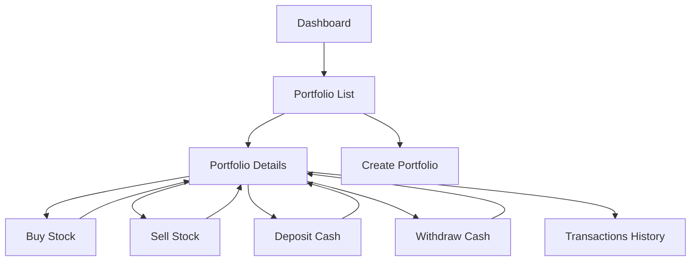

## 1. Product Overview

Portfolio Manager (PLN) is a web application for managing multiple investment portfolios with all values handled in Polish Zloty (PLN). The system enables users to track stock transactions, monitor portfolio performance, and visualize investment allocation through interactive charts.

The application solves the problem of manual portfolio tracking by automating calculations, providing real-time valuations, and offering comprehensive performance analytics for individual investors and small investment groups.

## 2. Core Features

### 2.1 User Roles

| Role | Registration Method | Core Permissions |
|------|---------------------|------------------|
| Portfolio Manager | Local account creation | Create portfolios, execute transactions, view analytics |

### 2.2 Feature Module

The portfolio management system consists of the following main pages:
1. **Dashboard**: Overview of all portfolios, total assets, performance metrics
2. **Portfolio List**: Display all created portfolios with key metrics
3. **Portfolio Details**: Individual portfolio view with holdings, cash balance, and performance
4. **Transactions History**: Complete transaction log with filtering and sorting capabilities

### 2.3 Page Details

| Page Name | Module Name | Feature description |
|-----------|-------------|---------------------|
| Dashboard | Portfolio Overview | Display total portfolio count, combined value, and overall performance metrics |
| Dashboard | Performance Summary | Show total deposits, current value, profit/loss in PLN and percentage |
| Portfolio List | Portfolio Cards | List all portfolios with name, current value, cash balance, and performance indicators |
| Portfolio List | Quick Actions | Provide buttons for creating new portfolio and accessing individual portfolios |
| Portfolio Details | Holdings Table | Display all stock holdings with quantity, average price, current price, and value |
| Portfolio Details | Cash Information | Show current cash balance and total deposits made |
| Portfolio Details | Performance Metrics | Calculate and display total portfolio value, profit/loss amounts and percentages |
| Portfolio Details | Transaction Controls | Include buttons for buying stocks, selling stocks, depositing and withdrawing cash |
| Portfolio Details | Allocation Chart | Visual representation of portfolio allocation using pie chart |
| Transactions History | Transaction Table | List all transactions chronologically with ticker, type, quantity, price, and total value |
| Transactions History | Filter Controls | Allow filtering by portfolio, transaction type, date range, and ticker symbol |
| Transactions History | Export Function | Enable transaction data export for external analysis |

## 3. Core Process

### Portfolio Management Flow
Users begin by creating a new portfolio with an initial name and optional cash deposit. Once created, they can execute various transactions including stock purchases, sales, cash deposits, and withdrawals. The system automatically calculates weighted average prices for holdings and tracks all profit/loss calculations. Price data is fetched once at application startup and cached for consistent valuations throughout the session.

### Transaction Execution Flow
When buying stocks, the system verifies sufficient cash balance, updates the holding quantity, recalculates the weighted average price, and records the transaction. For selling stocks, the system confirms adequate share quantity, calculates realized profit based on the average purchase price, adds proceeds to cash balance, and maintains the original average price for remaining shares.

## 4. User Interface Design

### 4.1 Design Style
- **Primary Colors**: Deep blue (#1e40af) for headers and primary actions, green (#059669) for positive values, red (#dc2626) for negative values
- **Button Style**: Rounded corners with subtle shadows, hover effects for interactive feedback
- **Typography**: Clean sans-serif fonts (Inter or system fonts), 14-16px for body text, 18-20px for headers
- **Layout**: Card-based design with consistent spacing, responsive grid system for data tables
- **Icons**: Minimalist line icons for navigation and actions, consistent 16x16px size

### 4.2 Page Design Overview

| Page Name | Module Name | UI Elements |
|-----------|-------------|-------------|
| Dashboard | Portfolio Overview | Card layout with metric tiles, blue gradient headers, white background cards |
| Portfolio List | Portfolio Cards | Grid of cards showing portfolio metrics, green/red performance indicators, hover shadows |
| Portfolio Details | Holdings Table | Striped rows, sortable columns, green text for gains, red for losses, action buttons |
| Portfolio Details | Allocation Chart | Centered pie chart with legend, interactive tooltips on hover |
| Transactions History | Transaction Table | Date-based sorting, type badges (BUY/SELL), formatted currency values |

### 4.3 Responsiveness
Desktop-first design approach with mobile adaptation. Tables convert to card layouts on smaller screens, charts maintain readability with touch-friendly interactions, and navigation collapses into hamburger menu for mobile devices.

### 4.4 Chart Requirements
- **Allocation Pie Chart**: Interactive segments showing percentage breakdown of holdings
- **Portfolio Value Bar Chart**: Comparison of portfolio values with performance indicators
- **Chart.js Integration**: Smooth animations, responsive design, customizable color schemes