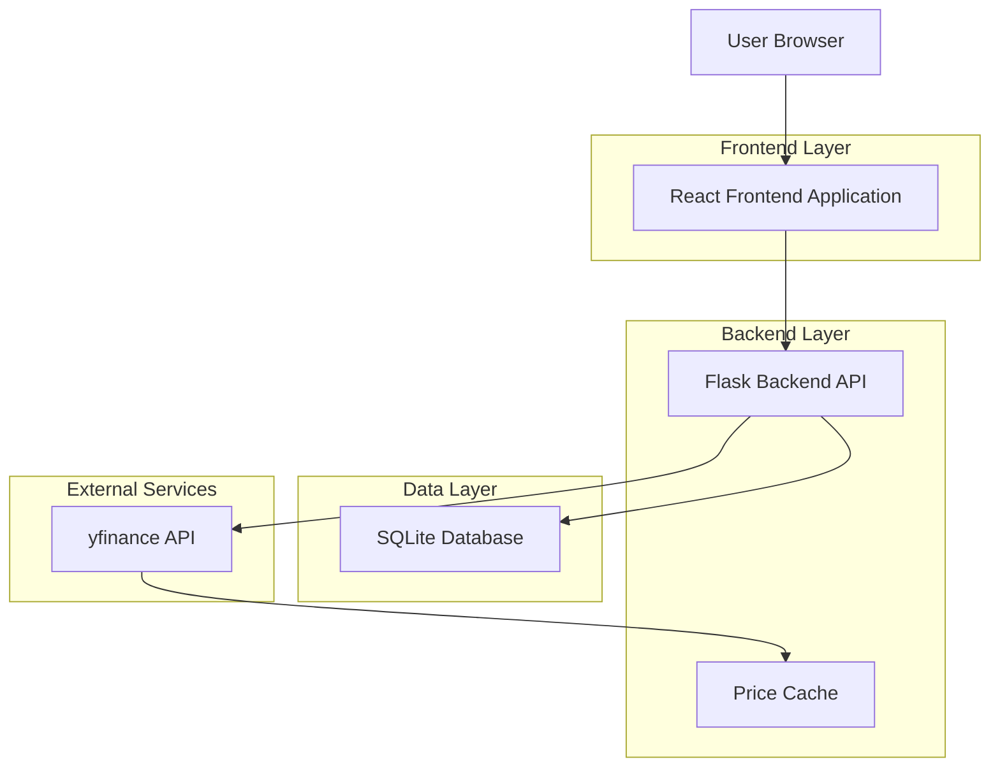
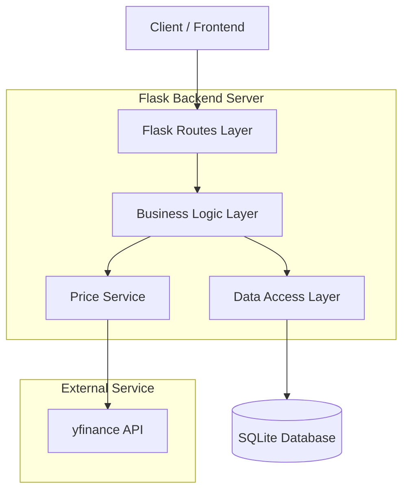
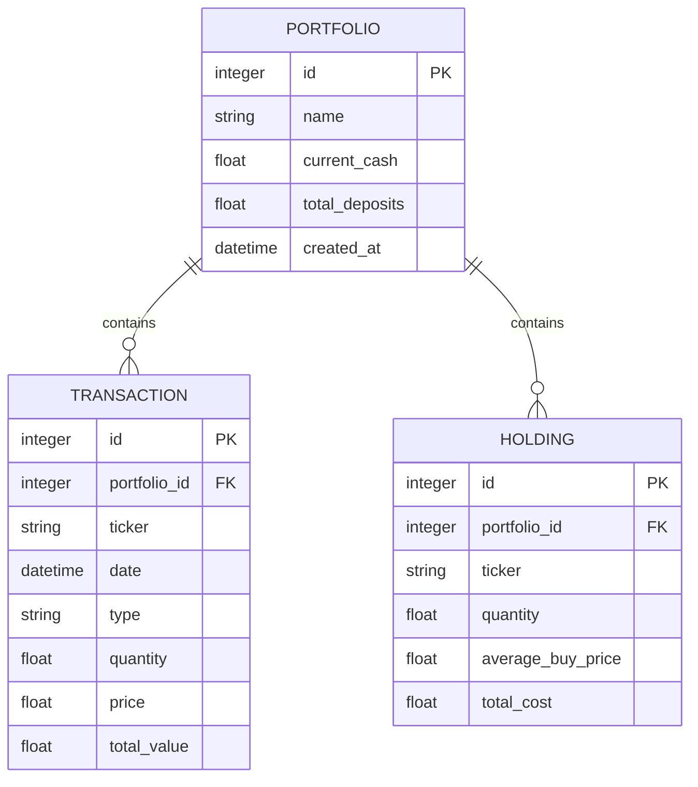

## 1. Architecture Design



## 2. Technology Description

- **Frontend**: React@18 + Chart.js@4 + axios
- **Initialization Tool**: create-react-app
- **Backend**: Flask@2 + Flask-CORS + SQLite3
- **Database**: SQLite (local file-based)
- **External API**: yfinance for stock price fetching

## 3. Route Definitions

| Route | Purpose |
|-------|---------|
| / | Dashboard page, displays portfolio overview and metrics |
| /portfolios | Portfolio list page, shows all created portfolios |
| /portfolio/:id | Portfolio details page, individual portfolio view with holdings |
| /transactions | Transactions history page, complete transaction log |
| /portfolio/:id/buy | Buy stock form page |
| /portfolio/:id/sell | Sell stock form page |

## 4. API Definitions

### 4.1 Portfolio Management APIs

**Create Portfolio**
```
POST /api/portfolio/create
```

Request:
| Param Name | Param Type | isRequired | Description |
|------------|------------|------------|-------------|
| name | string | true | Portfolio name |
| initial_cash | float | false | Initial cash deposit (default: 0) |

Response:
| Param Name | Param Type | Description |
|------------|------------|-------------|
| id | integer | Portfolio ID |
| name | string | Portfolio name |
| current_cash | float | Current cash balance |
| total_deposits | float | Total deposits made |

**List Portfolios**
```
GET /api/portfolio/list
```

Response:
| Param Name | Param Type | Description |
|------------|------------|-------------|
| portfolios | array | Array of portfolio objects |

**Deposit Cash**
```
POST /api/portfolio/deposit
```

Request:
| Param Name | Param Type | isRequired | Description |
|------------|------------|------------|-------------|
| portfolio_id | integer | true | Target portfolio ID |
| amount | float | true | Deposit amount in PLN |

**Withdraw Cash**
```
POST /api/portfolio/withdraw
```

Request:
| Param Name | Param Type | isRequired | Description |
|------------|------------|-------------|
| portfolio_id | integer | true | Target portfolio ID |
| amount | float | true | Withdrawal amount in PLN |

**Buy Stock**
```
POST /api/portfolio/buy
```

Request:
| Param Name | Param Type | isRequired | Description |
|------------|------------|-------------|
| portfolio_id | integer | true | Target portfolio ID |
| ticker | string | true | Stock ticker symbol |
| quantity | float | true | Number of shares (supports fractions) |
| price | float | true | Price per share in PLN |

**Sell Stock**
```
POST /api/portfolio/sell
```

Request:
| Param Name | Param Type | isRequired | Description |
|------------|------------|-------------|
| portfolio_id | integer | true | Target portfolio ID |
| ticker | string | true | Stock ticker symbol |
| quantity | float | true | Number of shares to sell |
| price | float | true | Selling price per share in PLN |

**Get Portfolio Value**
```
GET /api/portfolio/value/:id
```

Response:
| Param Name | Param Type | Description |
|------------|------------|-------------|
| portfolio_value | float | Total portfolio value |
| cash_value | float | Current cash balance |
| holdings_value | float | Value of all stock holdings |
| total_result | float | Profit/loss amount |
| total_result_percent | float | Profit/loss percentage |

**Get Holdings**
```
GET /api/portfolio/holdings/:id
```

Response:
| Param Name | Param Type | Description |
|------------|------------|-------------|
| holdings | array | Array of holding objects with ticker, quantity, avg_price |

**Get Transactions**
```
GET /api/portfolio/transactions/:id
```

Response:
| Param Name | Param Type | Description |
|------------|------------|-------------|
| transactions | array | Array of transaction objects with date, type, ticker, quantity, price |

## 5. Server Architecture Diagram



## 6. Data Model

### 6.1 Data Model Definition



### 6.2 Data Definition Language

**Portfolios Table**
```sql
CREATE TABLE portfolios (
    id INTEGER PRIMARY KEY AUTOINCREMENT,
    name VARCHAR(100) NOT NULL,
    current_cash DECIMAL(10,2) DEFAULT 0.00,
    total_deposits DECIMAL(10,2) DEFAULT 0.00,
    created_at TIMESTAMP DEFAULT CURRENT_TIMESTAMP
);

CREATE INDEX idx_portfolios_name ON portfolios(name);
```

**Transactions Table**
```sql
CREATE TABLE transactions (
    id INTEGER PRIMARY KEY AUTOINCREMENT,
    portfolio_id INTEGER NOT NULL,
    ticker VARCHAR(10) NOT NULL,
    date TIMESTAMP DEFAULT CURRENT_TIMESTAMP,
    type VARCHAR(4) NOT NULL CHECK (type IN ('BUY', 'SELL')),
    quantity DECIMAL(10,4) NOT NULL,
    price DECIMAL(10,2) NOT NULL,
    total_value DECIMAL(10,2) NOT NULL,
    FOREIGN KEY (portfolio_id) REFERENCES portfolios(id)
);

CREATE INDEX idx_transactions_portfolio ON transactions(portfolio_id);
CREATE INDEX idx_transactions_ticker ON transactions(ticker);
CREATE INDEX idx_transactions_date ON transactions(date);
```

**Holdings Table**
```sql
CREATE TABLE holdings (
    id INTEGER PRIMARY KEY AUTOINCREMENT,
    portfolio_id INTEGER NOT NULL,
    ticker VARCHAR(10) NOT NULL,
    quantity DECIMAL(10,4) NOT NULL,
    average_buy_price DECIMAL(10,2) NOT NULL,
    total_cost DECIMAL(10,2) NOT NULL,
    UNIQUE(portfolio_id, ticker),
    FOREIGN KEY (portfolio_id) REFERENCES portfolios(id)
);

CREATE INDEX idx_holdings_portfolio ON holdings(portfolio_id);
CREATE INDEX idx_holdings_ticker ON holdings(ticker);
```